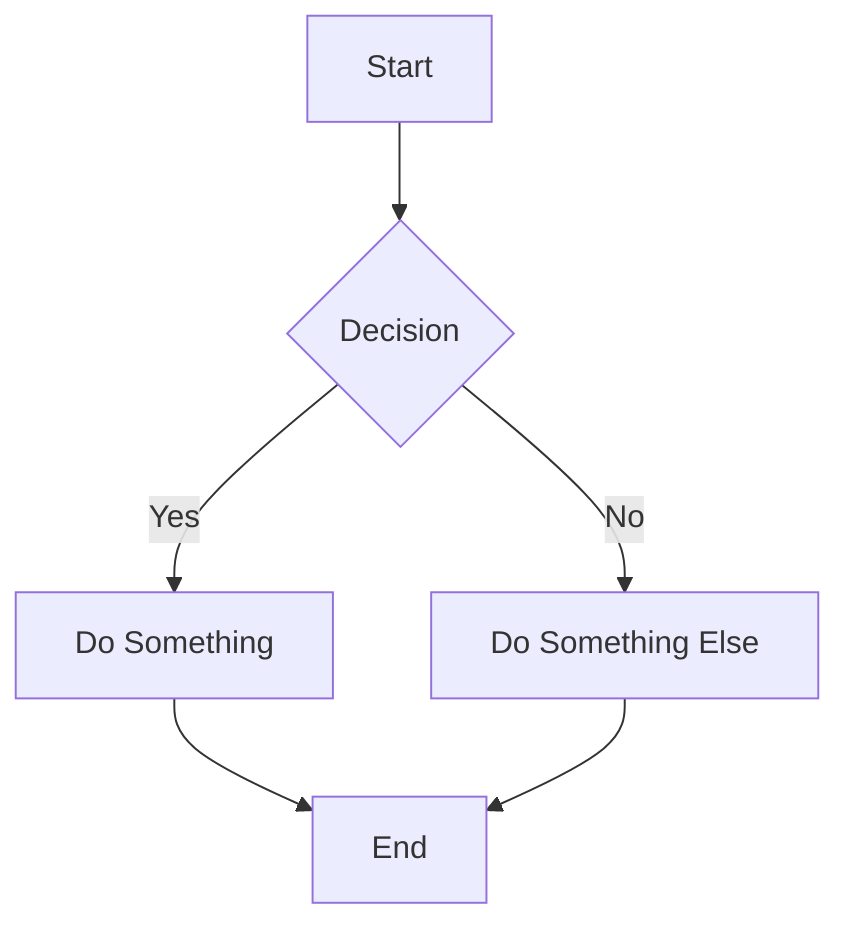
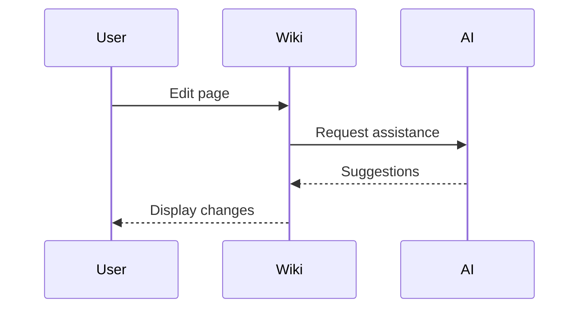
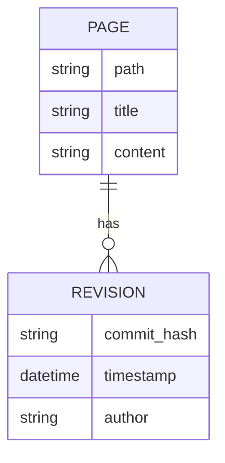
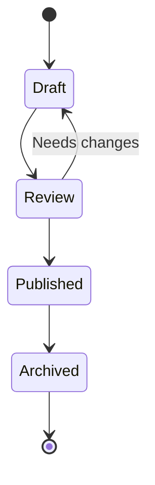
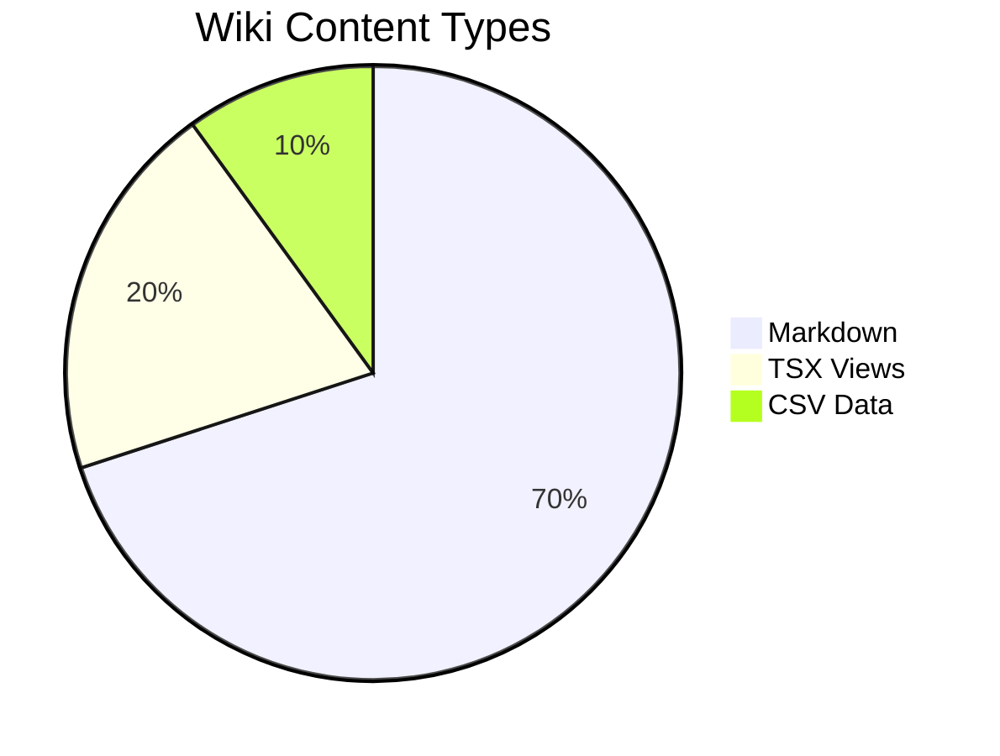
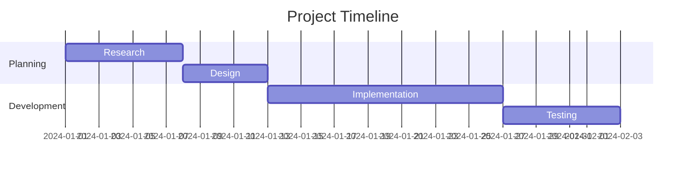

# Mermaid Diagrams

This wiki supports [Mermaid](https://mermaid.js.org/) diagrams. Use fenced code blocks with the `mermaid` language identifier.

## Basic Flowchart

## Sequence Diagram

## Entity Relationship Diagram

## State Diagram

## Pie Chart

## Gantt Chart

## Usage Tips

1. **Edit mode**: Shows raw mermaid code for editing
2. **View mode**: Renders the diagram as SVG
3. **Syntax errors**: Invalid syntax displays an error message with details
4. **Responsive**: Diagrams scale to fit the container width

## More Examples

See the [Mermaid documentation](https://mermaid.js.org/syntax/flowchart.html) for complete syntax reference.
